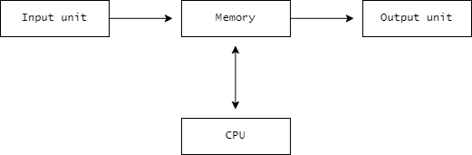
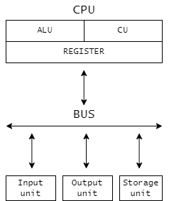

# Computer System Overview

## What is a computer system?
_An electronic system which takes input, processes it and gives the required output._

Basic organisation of a Computer System            |  Detailed organisation
:-------------------------:|:-------------------------:
  |  

* **CPU contains 3 components within it**
  * `ALU` - The Arithmetic Logic Unit is a component of the computer's processor which does all the arithmetic - adding, multiplication, etc. and also all the logical operations - and, or, etc.
  
  * `CU` - The Control unit acts like a traffic regulator who gives signals following which the vehicles move correctly to avoid collision.
  
  * `REGISTERS` - Very fast computer memory which are used to execute programs and operations efficiently. This does by giving access to commonly used values, i.e., the values which are in the point of operation/execution at that time.

* `Input unit` -  An equipment used to provide data and control signals to an information processing system, such as a computer or information appliance.

* `Output unit` - A piece of computer hardware that receives data from a computer and then translates that data into another form. That form may be audio, visual, textual, or hard copy such as a printed document.


* `Storage devices` - They are used to store data and files permanently. Depending on the use case scenario, storage capacity varies from `MB` to `TB`.

<!-- * `Blu-ray discs` - Blu-ray is a format where digital data is pressed into tiny pits or cooked into tiny spots on a disc, and then read back by a laser. CDs used an infrared laser, which only allowed the size and spacing of the dots such that a disc could only contain about 800 megabytes of data. Blu-ray uses a blue laser to allow even more dots - 25 or 50 gigabytes. -->

* `BUS` - A bus is the name for a channel that transfers data between different componenets of the computer - for example between the hard drive and the RAM, the RAM and the CPU, the CPU and the Graphics card etc.

  *  `Data BUS` - These are used to carry data between memory, processor and I/O devices.
  *  `Control BUS` - Control bus are conducting wires inside a system which is used to generate timing and control signals to control all the associated peripherals.

---

## Memory
_The storage space in the computer, where data is to be processed and instructions required for processing are stored. It is a hardware component in the form of micro-chip which stores contents in electronic form._

> The smallest unit to measure memory size is known as `Bit` (0/1).

```cpp
 /* 8 Bits = 1 Byte 
 1024 B = 1 KB
 1024 KB = 1 MB
 1024 MB = 1 GB
 1024 GB = 1 TB */
```

* **Types of memory**

    * `RAM` - RAM is an acronym for "Random Access Memory." It is a volatile memory device typically in a chipset. It is used by processes to access and temporarily store needed memory assets, so processes can be done. This type of memory is very large in size, hence access to it is random order.

    * *`ROM`* - ROM stands for Read Only Memory and this is used for certain data that is not usually meant to be changed. This type of data is generally only meant to be read (Read Only). An example will be your BIOS or any type of firmware.

    * `Cache` - Cache is a form of memory that is smaller but faster than regular memory. The computer tries to use cache memory for the information it uses most often. There can be several levels of cache, each smaller but faster than the next. These levels are called L1, L2, L3 etc.

---

## Softwares

* **System software** - It is a type of software which is used to make a particular system or hardware functional.
For example Operating system, Software used in automobile assembly, Launching of satellite.

* **Application software** - These are used primarily for dealing with user data. Software used for banking system, billing system for a shop, ticket booking or any software that deals with data for benefit of an organisation or common user.

---

## Operating system

_A type of system software which makes a computer system functional. It is a set of programs which makes effective and efficient use of computer resources such as CPU, Memory and Storage._

* **Major functions of an OS**
    1. Processor management
    2. Storage device management
    3. Memory management
    4. I/O device management

---