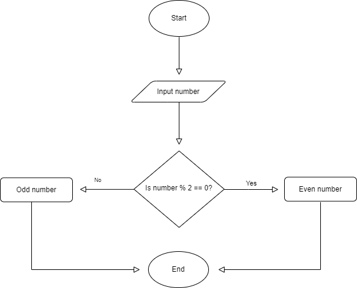

# Flowcharts and Algorithms

## Flowchart
_A flowchart simply is a simplified chart for humans to better visualize the different states a program can find itself in and how the program gets to those states._

### Common shapes

|  Shape      |    Name    |    Desciption    |
|:------:|:------:|:------:|
|        |   Terminal     |  Starting or ending of a flowchart      |
|        |   Input/Output    |  Receiving data and displaying processed data.      |
|        |   Processing     |  Used to show that something is performed.|
|        |   Decision     |  To show where a decision is necessary, commonly a Yes/No question or True/False.      |
|        |   Flow line     |  Shows the direction which the flowchart will flow.      |
|        |   Connector     |  Used to denote contnuity of a flowchar if it is on multiple pages.      |

**Example -**
Flowchart to check whether a number is even or odd.



---

## Algorithm
_Algorithms is a series of steps that is performable by a machine without the use of human intelligence._

### Algorithm to check if a number is prime or composite

```cpp
/* STEP 1: Take num as input.
STEP 2: Initialize a variable temp to 0.
STEP 3: Iterate a “for” loop from 2 to num/2.
STEP 4: If num is divisible by loop iterator, then increment temp.
STEP 5: If the temp is equal to 0, Return “It is a prime number”.
        Else, Return “Composite number”.*/
```

---

## Algorithm Vs Pseudo-code
Pseudocode is like very "lazy" programming. You just write a mix of code and English but it shows all the big high level ideas that you need the program to do, without getting into the dirty details of actual full code. Pseudocode is meant to be independent from a language but still describes what the program has to do.

Algorithms are removed from pseudocode and code in general and is much more like a recipe. You don't go into the code aspects but describe the steps needed to solve the problem at a high or "theoretical" level.
